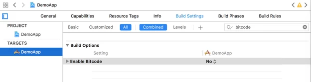
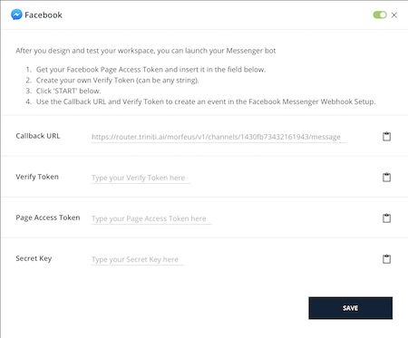
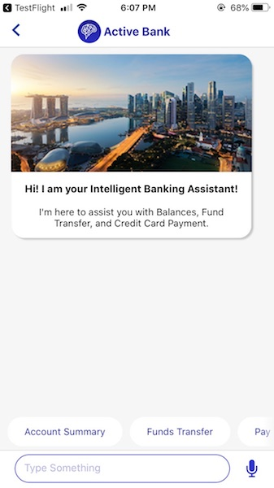

# How To / Tutorials

-A triniti Guide

## Overview
This tutorial walks you through the process of building a workspace from scratch. It also provides you the best practices in designing a workspace.

## Manage Your Account


### Signup for a New Account


You can register to [triniti.ai](#https://triniti.ai) by following these steps.

* Open a new tab from your browser.
* Type in [https://developer.triniti.ai](#https://developer.triniti.ai)
* Then, click on “Create Account” on top.

1.	Open URL: <https://developer.triniti.ai/>
2.	Click on the “Create Account” link.
3.	Enter First name, Last name, Email id, Mobile number & your desired password.
(CreateAccount1.png)
(CreateAccount2.png)
... (Note: All fields are mandatory)
4.	Password should be 

- should be 8 characters long
- at least one ‘upper case letter’
- at least one ‘small case letter’
- at least one ‘Special Character’( @, #, $ .. )
- at least one ‘Number’

5.	Click on the “Create Account” button.
6.	An email notification will be sent to the registered email address.(CreateAccount3.png)(CreateAccount4.png)
7.	Access your registered email & click on the “Verify Email” button.
8.	Verification will be completed successfully & the Home page will be displayed.
(CreateAccount5.png)


> At the moment, we accept only sign ups using corporate email addresses. Triniti portal does not recognise emails created via free service such as  example@gmail.com, example@yahoo.com or any other similar Id.

* Fill in the form. 


> While creating your password, make sure to make it at least eight characters long with at least one special character.

* Once you fill in the form, carefully go through the Terms of Services. By selecting ‘proceed’, you are giving us an acknowledgement that you have successfully read our terms and conditions.
* Select the ‘Create Account’ button.

A verification email will be sent to the email address you have used, to create your triniti account. Open the email and follow the instructions given to complete creating your account. This will lead you to the Triniti website’s home page.


Congratulations. You have created your first triniti account! 

We are so happy to welcome you onboard. Eagerly looking forward to collaborate and grow along with you! 

### Login to your triniti account

> If you already have an account, select the ‘login’ button on top where it reads "Already have an account? Login"

* Open a new tab from your browser.
* Type in [https://developer.triniti.ai](#https://developer.triniti.ai)
* Enter your email id and password and select the  “Login” button. 

### Recover your Triniti account

To recover your triniti account, 

* Open a new tab from your browser.
* Type in [https://developer.triniti.ai](#https://developer.triniti.ai)
* Select ‘Recover Account’ at the login page 
* Enter the email id you used to created your triniti account.
* Click on “Recover”.

An email will be sent to your mail address. Follow the instructions given in the email to recover your triniti account.


1.	Open a browser on your laptop/desktop.
2.	Enter the URL & press enter.
3.	Click on the “Recover Account”
4.	Enter your registered email address & “Send email” button.(RecoverAccount1.png)

- Password reset confirmation will be displayed with an option of “Resending email” in case email not received in your registered mail id.(RecoverAccount2.png)
- An email notification will be sent to your registered email address with further details(RecoverAccount3.png)
- Click on the “Reset password” button on the email notification.
- Password reset option will be displayed on the browser.
- Enter your new password & confirm.
(RecoverAccount4.png)


##Manage Your WorkSpace


### Create a Workspace

**Workspace** as the name indicates, is a space that triniti provides you for you to do the bot building process. It is similar to a digital folder that you will be provided with, upon purchase to start with building your bot. 
> Before you could start, make sure you have a Triniti.ai account. If you do not have an account, go to triniti’s login page and create an account.

This section describes how to create and try out your first triniti.ai workspace.


* Open a new tab and log in to triniti.ai Login webpage.
* Once you have gained access to our Trinti dashboard, click on “Create Workspace +”.
* Type in your workspace name, choose your preferred language, your country and choose the project type you want to create and select the “Next” button.
* We provide three types of workspace.
 - [Cognitive QnA](#faq-workspace)
 - [Conversational AI](#conversational-ai-workspace)
 - [Cognitive QnA & Conversational AI](#faq-workspace)


> Refer to (project types)[#projecttypes] to understand each of its features.
 
* Along with different base data sets to bootstrap your workspace. (Just that the questions will be treated in that domain and our bot will understand words that make sense in that domain.)
 - [Retail-Banking](#retail-banking)
 - [Corporate-Banking](#corporate-banking)
 - [Wallets](#wallets)
 - [Insurance](#insurance)
 - [Medical](#medical)
 - [Custom](#custom)
* We provide multiple plans in order to target your specific needs. Please go through the [features](#features) section to understand our offerings. We have the following payment plans.
 - [Free](#free)
 - [Basic](#basic)
 - [Premium](#premium)

> Depending on the plan you choose, the costs may vary. Look into the (pricing section)[#pricingsection]  for details.

Once you have chosen your plan, go ahead and create your first workspace by selecting the ‘Create Workspace’ button.

Congratulations!!! You have now created your very first workspace !!!

## Manage users for a Workspace

## Delete a Workspace

## Manage Settings 

## Manage Messages 

## Manage FAQ

### Adding New FAQ's


#### How to setup FAQ (import from excel, csv or from website URL)?

1.	Click on workshop name, and import the FAQ to Train 
2.	On Importing the File, the list of Added FAQ is shown in the FAQ page
3.	On importing from URL, copy paste the website FAQ page URL
4.	Select Import button
(ImportFAQ1.png)

#### How to change the FAQ response format?

1.	Add New question in user asks field, add the answer in Bot Answer field and select default channel.
2.	Click on Add Question Set.
(FAQResponseFormat1.png)
3.	Click on Change format to view different available formats.
(ImportFAQ3.png)

A.	Plain Text:

- Enter the answer in write answer field and click on Add question set for creating the new question.
(ImportFAQ4.png)

B.	Buttons:

- Enter the title and click on Button to select Link or post back.(ImportFAQ5.png)
- Selecting the Link, add type button title, and enter the URL.(ImportFAQ6.png)

C.	Carousel / List:

- Click on carousel or List button in change format view page  (ImportFAQ7.png)
- Click on Add card(carousel), Add Item (List), enter the image URL, Title and subtitle(ImportFAQ8.png)
- Click on Add Button, select Link or Post back and enter button title and button URL(ImportFAQ9.png)

D.	Image:

- Select Response format as “Image”.
- Copy paste the image URL.(ImportFAQ10.png)

E.	SSML:

- Click on SSML by selecting change format, enter the SSML answer in write answer field.(ImportFAQ11.png)

#### How to add Quick replies:

- Click on Add Quick replies, enter the title and pay load in the fields type quick reply title and type quick payload respectively.(ImportFAQ12.png)
- For all question able to add tags, below the bot answer.(ImportFAQ13.png)
- Once after adding the user ask, bot answer and tag field click on Add question set for creating the FAQ.(ImportFAQ14.png)

#### How to add Smalltalk?

a.	Select Smalltalk option from the left menu
b.	Click on view to edit the answer.
(SmallTalk1.png)

#### How to set the minimum confidence score?

We can set the Minimum confidence score to get the answers from bot. If user utterances are less than the minimum confidence score configured then then error message will be displayed.

a.	Select the Setting icon image displayed beside bot in left menu.
b.	Select General tab.
c.	Set minimum confidence score as 65.
d.	Configure “Default Error” message from messages tab.
(General1.png)
(General2.png)
(General3.png)

#### How to customise websSDK?

We can customise the webSDK look and feel.

a.	Select “Channels” from left menu
b.	Select the “Settings” icon displayed in webSDK channel.
(Channel1.png)
(Channel2.png)
(Channel3.png)

#### How to embed webSDK into website?
#### Code Snippet?

### Managing KeyPhrases
### Handling Unknown Words
### Formatting FAQ Responses
### Redirecting FAQ's to Workflows
### Setting up Channel Specific Responses
### Handling Ambiguity
### Managing FAQ Settings
### Fine Tuning FAQ's

## Define Intents

### Adding Intents
### Annotating & Linking Entities
### Importing & Exporting Intents

## Manage Dialogs

### { Direct Link } to Concept

## Definine Entities

### Adding Entities
### Managing Dictionary Entities
### Managing XXX Entities
### Importing & Exporting Entities
### Default Entities

## Manage Small Talk

### { Direct Link } to Concept

## Define Acronymns

### { Direct Link } to Concept

## Manage Fullfillment via Webhooks

### Defining a Webhook
### Webhook Signature
### Conversational Workflow Framework
### Handling Responses

## Manage Fullfillment via Workflows


### Defining a Workflow
### Configuring a Workflow
### Handling Validations
### Business Logic via Webhooks
### Scripting via Javascript
### Scripting via Groovy
### Conversation Model Reference
### Handling Responses
### Debugging Workflows

## Manage Channels

### Managing Web & Hybrid
### Customizing Web & Hybrid Channels
### Managing Android 

**Overview**

 Android SDK provides a lightweight conversational / messaging UX interface for users to interact to the Triniti Platform. The SDK enables rich conversation components to be embedded in existing Android Mobile Apps.

**Pre Requisites**


*   Android Studio 2.3+
*   Android 4.4.0+

**Install and configure dependencies**

**Download SDK**

Download the Morfeus SDK from the given URL or other channels communicated to you. Extract MorfeusAndroidSDK_Hybrid.zip file which you have downloaded.

**Add SDK to your Android Studio project**


1.  Open your application's Android Studio project.
1.  Copy `MFSDKHybridKit.aar` file to project's `app/libs` folder.
1.  Create a new libs folder under app directory if it does not exist.
1.  Add the following dependencies to your app level `build.gradle` file.

    ```
dependencies {
    ...
   // Voice SDK
   compile ('com.morfeus.android.voice:MFSDKVoice:1.1.3')
   // gRPC
   compile 'io.grpc:grpc-okhttp:1.13.1'
   compile 'io.grpc:grpc-protobuf-lite:1.13.1'
   compile 'io.grpc:grpc-stub:1.13.1'
   compile 'io.grpc:grpc-android:1.13.1'
   compile 'javax.annotation:javax.annotation-api:1.2'

    // OAuth2 for Google API
   compile('com.google.auth:google-auth-library-oauth2-http:0.7.0') {
        exclude module: 'httpclient'
    }
   compile(name: 'MFSDKHybridKit', ext: 'aar')
   compile 'com.google.guava:guava:20.0'
   compile 'com.android.support:appcompat-v7:25.0.0'
    ...
}
 repositories {
    flatDir {
        dirs 'libs'
    }
}
```

	Note:If you get 64k method limit exception during compile time then add following code into your app-level build.gradle file.

	```
android {
    defaultConfig {
        multiDexEnabled true
    }
}
dependencies {
    compile 'com.android.support:multidex:1.0.1'
}
```
	Add the following lines to your project level `build.gradle` file.

	```
allprojects {
   repositories {
       google()
       jcenter()
       maven {
           url "http://artifacts.active.ai/artifactory/android-sdk-release"
           credentials {
               username = "artifactory_username"
               password = "artifactory_password"
           }
       }
   }
}
```

**Initialize the SDK**

To initialize Morfeus SDK pass given `BOT_ID`, `BOT_NAME` and `END_POINT_URL` to `MFSDKMessagingManagerKit`. You must initialize Morfeus SDK once across the entire application.

Add following lines to your Activity/Application where you want to initialize the Morfeus SDK.` onCreate() `of Application class is best place to initialize. If you have already initialized MFSDK, reinitializing MFSDK will throw `MFSDKInitializationException`.


```
try {
    // Properties to pass before initializing sdk
    MFSDKProperties properties = new MFSDKProperties
                    .Builder(END_POINT_URL)
                    .addBot(BOT_ID, BOT_NAME)
                    .setSpeechAPIKey("YourSpeechAPIKey")
                    .build();
      
    // sMFSDK is public static field variable
    sMFSDK = new MFSDKMessagingManagerKit
                    .Builder(applicationContext)
                    .setSdkProperties(properties)
                    .build();
      
    // Initialize sdk
    sMFSDK.initWithProperties();
  
} catch (MFSDKInitializationException e) {
    Log.e("MFSDK", e.getMessage());
}
```


**Properties:**


<table>
  <tr>
   <td><strong>Property</strong>
   </td>
   <td><strong>Description</strong>
   </td>
  </tr>
  <tr>
   <td>BOT_ID
   </td>
   <td>The unique ID for the bot.
   </td>
  </tr>
  <tr>
   <td>BOT_NAME
   </td>
   <td>The bot name to display on top of chat screen.
   </td>
  </tr>
  <tr>
   <td>END_POINT_URL
   </td>
   <td>The bot API URL.
   </td>
  </tr>
</table>

Above properties you can get through nevigating to Channels > Android click on settings icon.


**Invoke Chat Screen**

To invoke chat screen call `showScreen()` method of `MFSDKMessagingManagerKit`. Here, `sMSDK` is an instance variable of `MFSDKMessagingManagerKit`.


```
// Open chat screen
sMFSDK.showScreen(activityContext, BOT_ID);
```


You can get instance of `MFSDKMessagingManagerKit` by calling `getInstance() `of `MFSDKMessagingManagerKit`. Please make sure before calling `getInstance()` you have initialized the MFSDK. Please check following code snippet. 


```
try {
    // Get SDK instance
    MFSDKMessagingManager mfsdk = MFSDKMessagingManagerKit.getInstance();
  
    // Open chat screen
    mfsdk.showScreen(activityContext, BOT_ID);
  
} catch (Exception e) {
    // Throws exception if MFSDK not initialised.
}
```


**Compile and Run**

Once above code is added you can build and run your application. On launch of chat screen, welcome message will be displayed. 


**Providing User/Session Information**

You can pass set of user/session information to the MFSDK using `MFSDKSessionProperties` builder. In following example we are passing Customer ID to MFSDK.


```
HashMap<String, String> userInfoMap      = new HashMap();
userInfo.put("CUSTOMER_ID", customerID);
userInfo.put("SESSION_ID", sessionID); // Pass your app sessionID

MFSDKSessionProperties sessionProperties = new MFSDKSessionProperties
                                              .Builder()
                                              .setUserInfo(userInfoMap)
                                              .build();

// Open chat screen 
mMFSdk.showScreen(LoginActivity.this, BOT_ID,  sessionProperties);
```

**Close chat screen with/without animation**

To close the chat screen call ` closeScreen(String botId, boolean withAnimation) `method of `MFSDKMessagingManager` with/without exit animation. Set second parameter to false to close screen without animation. 

```
// Close chat screen without exit animation
sMFSdk.closeScreen(BOT_ID, false);
```

**Enable voice chat**

If you haven't added required dependencies for voice than please add following dependencies in your project's build.gradle file. 

app/build.gradle

```
dependencies {
    ...
    // Voice SDK dependencies
    compile ('com.morfeus.android.voice:MFSDKVoice:1.1.3')
    compile 'io.grpc:grpc-okhttp:1.13.1'
    compile 'io.grpc:grpc-protobuf-lite:1.13.1'
    compile 'io.grpc:grpc-stub:1.13.1'
    compile 'io.grpc:grpc-android:1.13.1'
    compile 'javax.annotation:javax.annotation-api:1.2'
    compile('com.google.auth:google-auth-library-oauth2-http:0.7.0') {
        exclude module: 'httpclient'
    }
    ...
}
 
repositories {
    flatDir {
        dirs 'libs'
    }
}
```
project/build.gradle

```
allprojects {
   repositories {
       google()
       jcenter()
       maven {
           url "http://artifacts.active.ai/artifactory/android-sdk-release"
           credentials {
               username = "artifactory_username"
               password = "artifactory_password"
           }
       }
   }
}
```


Call `setSpeechAPIKey(String apiKey)` method of` MFSDKProperties` builder to pass speech API key. 


```
try {
    // Set speech API key
    MFSDKProperties properties = new MFSDKProperties
                    .Builder(END_POINT_URL)
                    ...
                    .setSpeechAPIKey("YourSpeechAPIKey")
                    ... 
                    .build();
      
   } catch (MFSDKInitializationException e) {
    Log.e("MFSDK", e.getMessage());
}
```
 
**Set Speech-To-Text language**

In MFSDKHybridKit, English(India) is the default language set for Speech-To-Text. You can change STT language by passing valid language code using `setSpeechToTextLanguage("lang-Country") `method of` MFSDKProperties.Builder.` You can find list of supported language code [here](https://cloud.google.com/speech-to-text/docs/languages).


```
try {
    // Set speech to text language
    MFSDKProperties properties = new MFSDKProperties
                    .Builder(END_POINT_URL)
                    ...
                    .setSpeechToTextLanguage("en-IN")
                    ... 
                    .build();
      
   } catch (MFSDKInitializationException e) {
    Log.e("MFSDK", e.getMessage());
}
```


**Set Text-To-Speech language**

English(India) is the default language set for Text-To-Speech. You can change TTS language by passing valid language code using setTextToSpeechLanguage(`"lang-Country"`) method of `MFSDKProperties.Builder. `You can find list of supported language code [here](https://www.oracle.com/technetwork/java/javase/javase7locales-334809.html#util-text).


```
try {
    // Set text to speech language
    MFSDKProperties properties = new MFSDKProperties
                    .Builder(END_POINT_URL)
                    ...
                    .setTextToSpeechLanguage("en_IN")
                    ... 
                    .build();
      
   } catch (MFSDKInitializationException e) {
    Log.e("MFSDK", e.getMessage());
}
```

**Provide Speech Suggestions**

You can provide additional contextual information for processing user speech. To provide speech suggestions add list of words and phrases into `MFSpeechSuggestion.json` file and place it under assets folder of your project. You can add maximum 150 phrases into` MFSpeechSuggestion.json`. To see sample `MFSpeechSuggestion.json`, please download it from [here](http://artifacts.active.ai/artifactory/android-sdk-release/com/morfeus/android/voice/MFSDKVoice/MFSpeechSuggestion.json)<span style="text-decoration:underline;">.</span>


**Enable Analytics**

By default, analytics is disabled in SDK. To enable analytics set `enableAnalytics(true)` and pass analytics provider and id detail with `MFSDKProperpties`. Please check the following code snippet to enable analytics.


```
try {
    // Pass analytics properties
    MFSDKProperties properties = new MFSDKProperties
                    .Builder(END_POINT_URL)
                    ...
                    .enableAnalytics(true)
                    .setAnalyticsProvider("Your Analytics provider code")
                    .setAnalyticsId("Your Analytics ID")
                    ... 
                    .build();
      
} catch (MFSDKInitializationException e) {
    Log.e("MFSDK", e.getMessage());
}
```


   
### Managing IOS 

**Overview**

iOS SDK provides a lightweight conversational / messaging UX interface for users to interact to the Triniti Platform. The SDK enables rich conversation components to be embedded in existing iOS Mobile Apps.


**Prerequisites**


*   OS X (10.11.x)
*   Xcode 8.3 or higher
*   Deployment target - iOS 8.0 or higher 


**Install and configure dependencies** 

**1. Install Cocoapods**

`CocoaPods` is a dependency manager for Objective-C, which automates and simplifies the process of using 3rd-party libraries in your projects.  `CocoaPods` is distributed as a ruby gem, and is installed by running the following commands in Terminal App:


```
$ sudo gem install cocoapods
$ pod setup
```


**2. Update .netrc file**

The Morfeus iOS SDK are stored in a secured artifactory. Cocoapods handles the process of linking these frameworks with the target application. When artifactory requests for authentication information when installing `MFSDKWebKit`, cocoapods reads credential information from the file` .netrc`, located in `~/ directory`.

The `.netrc` file format is as explained: we specify machine(artifactory) name, followed by login, followed by password, each in separate lines. There is exactly one space after the keywords machine, login, password.


```
machine <NETRC_MACHINE_NAME>
login <NETRC_LOGIN>
password <NETRC_PASSWORD>
```

One example of .netrc file structure with sample credentials is as below. Please check with the development team for the actual credentials to use.


**Steps to create or update .netrc file**


1.  Start up Terminal in mac
1.  Type "`cd ~/`" to go to your home folder
1.  Type "`touch .netrc`", this creates a new file, If a file with name `.netrc` not found.
1.  Type "`open -a TextEdit .netrc`", this opens `.netrc` file in TextEdit
1.  Append the machine name and credentials shared by development team in above format, if it does not exist already.
1.  Save and exit TextEdit

**3. Install the pod**

To integrate `'MFSDKWebKit'` into your Xcode project, specify the below code in your Podfile


```
source 'https://github.com/CocoaPods/Specs.git'
#Voice support is available from iOS 8.0 and above
platform :ios, '7.1'
 
target 'TargetAppName' do
    pod '<COCOAPOD_NAME>'
end
```


Once added above code, run install command in your project directory, where your "`podfile`" is located.

```
$ pod install
```


If you get an error like "Unable to find a specification for <pod-name>", then run below command to update your specs to latest version.


```
$ pod repo update
```


When you want to update your pods to latest version then run below command.


```
$ pod update
```


Note: If we get "401 Unauthorized" error, then please verify your `.netrc` file and the associated credentials.

**4. Disable bitcode**

Select target open "`Build Settings`" tab and set "`Enable Bitcode`" to "`No`".





**5. Give permission**

Search for ".plist" file in the supporting files folder in your Xcode project. Update NSAppTransportSecurity to describe your app's intended HTTP connection behavior. Please refer [apple documentation](https://developer.apple.com/library/archive/documentation/General/Reference/InfoPlistKeyReference/Articles/CocoaKeys.html#//apple_ref/doc/uid/TP40009251-SW33) and choose the best configuration for your app. Below is one sample configuration.

 

```
<key>NSAppTransportSecurity</key>
<dict>
      <key>NSAllowsArbitraryLoads</key>
      <true/>
</dict>
```


**6. Invoke the SDK**

To invoke chat screen, create MFSDKProperties, MFSDKSessionProperties and then call the method showScreenWithBotID:fromViewController:withSessionProperties to present the chat screen. Please find below code sample.


```
// Add this to the .h of your file
#import "ViewController.h"
#import <MFSDKMessagingKit/MFSDKMessagingKit.h>
@interface ViewController ()<MFSDKMessagingDelegate>
@end

// Add this to the .m of your file
@implementation ViewController
// Once the button is clicked, show the message screen -(IBAction)startChat:(id)sender
{
    MFSDKProperties *params = [[MFSDKProperties alloc] initWithDomain:@"<END_POINT_URL>"];
    [params addBot:@"<BOT_ID>" botName:@"<BOT_NAME>"]; 
    params.messagingDelegate = self;
    [[MFSDKMessagingManager sharedInstance] initWithProperties:params];
    
    MFSDKSessionProperties *sessionProperties = [[MFSDKSessionProperties alloc]init];
    sessionProperties.userInfo = [[NSDictionary alloc] initWithObjectsAndKeys:@"KEY",@"VALUE", nil];
    [[MFSDKMessagingManager sharedInstance] showScreenWithBotID:@"<BOT_ID>" fromViewController:self withSessionProperties:sessionProperties];
}
  
@end
```


**Properties:**


<table>
  <tr>
   <td><strong>Property</strong>
   </td>
   <td><strong>Description</strong>
   </td>
  </tr>
  <tr>
   <td>BOT_ID
   </td>
   <td>The unique ID for the bot
   </td>
  </tr>
  <tr>
   <td>BOT_NAME
   </td>
   <td>The bot name to display on top of chat screen.
   </td>
  </tr>
  <tr>
   <td>END_POINT_URL
   </td>
   <td>The bot API URL
   </td>
  </tr>
</table>

Above properties you can get through nevigating to Channels > iOS click on settings icon.



**Compile and Run**

Once above code is added we can build and run. On launch of chat screen, welcome message will be displayed.





**Providing User/Session Information**

You can pass set of key value pairs to the MFSDK using userInfo(NSDictionary) in MFSDKSessionProperties. In following example we are passing Customer ID, Session ID to MFSDK.

```
 MFSDKSessionProperties *sessionProperties = [[MFSDKSessionProperties alloc]init];
 sessionProperties.userInfo = @{@"CUSTOMER_ID": @"<CUSTOMER_ID_VALUE>", @"SESSION_ID": @"<SESSION_ID_VALUE>", nil];
 [[MFSDKMessagingManager sharedInstance] showScreenWithBotID:@"<BOT_ID>" fromViewController:self withSessionProperties:sessionProperties];
```

**Retrieve Close Event**

To retrieve close event, implement the MFSDKMessagingDelegate. MFSDK will call onChatClose method when user touches back button, which results in closure of chat screen. 

Please check following code sample.


```
// Add this to the header of your file
#import "ViewController.h"
#import <MFSDKMessagingKit/MFSDKMessagingKit.h>
@interface ViewController ()<MFSDKMessagingDelegate>
@end
@implementation ViewController 
-(IBAction)startChat:(id)sender
{
    ...
    //Show chat screen
}
  
-(void)onChatClose
{
    NSLog(@"Chat screen closed, perform necessary action");
}
@end
```


**Close Chat Screen**

To close the chat screen without animation call closeScreenWithBotID:withAnimation: with the botId as first parameter and boolean value NO as second parameter.

```
 [[MFSDKMessagingManager sharedInstance] closeScreenWithBotID:@"<BOT_ID>" withAnimation:NO];
```

**Enable voice chat**

**Provide Speech API Key**

MFSDKWebKit supports text to speech and speech to text feature. The minimum iOS deployment target for voice feature is iOS 8.0. The pod file also needs to be updated with the minimum deployment target for voice feature. Speech API key can be passed using speechAPIKey in MFSDKSessionProperties as below. 


```
   MFSDKSessionProperties *sessionProperties = [[MFSDKSessionProperties alloc]init];
...
   sessionProperties.speechAPIKey = @"<YOUR_SPEECH_API_KEY>";
...
  [[MFSDKMessagingManager sharedInstance] showScreenWithBotID:@"<BOT_ID>" fromViewController:self withSessionProperties:sessionProperties];
```


Search for ".`plist`" file in the supporting files folder in your Xcode project. Add needed capabilities like below and appropriate description.


```
<key>NSSpeechRecognitionUsageDescription</key>
<string>SPECIFY_REASON_FOR_USING_SPEECH_RECOGNITION</string>

<key>NSMicrophoneUsageDescription</key>
<string>SPECIFY_REASON_FOR_USING_MICROPHONE</string>
```


**Set Speech-To-Text language**

English(India) is the default language set for Speech-To-Text. You can change STT language by passing valid language code using `speechToTextLanguage property of MFSDKSessionProperties.` You can find list of supported language code [here](https://cloud.google.com/speech-to-text/docs/languages).


```
MFSDKSessionProperties *sessionProperties = [[MFSDKSessionProperties alloc]init];
   sessionProperties.shouldSupportMultiLanguage = YES;
   sessionProperties.speechToTextLanguage = @"en-IN";
```

**Set Text-To-Speech language**

English(India) is the default language set for Text-To-Speech. You can change STT language by passing valid language code using `textToSpeechLanguage property of MFSDKSessionProperties.`Please set language code as per apple guidelines.


```
MFSDKSessionProperties *sessionProperties = [[MFSDKSessionProperties alloc]init];
   sessionProperties.shouldSupportMultiLanguage = YES;
   sessionProperties.textToSpeechLanguage = @"en-IN";
```

**Provide Speech Suggestions**

You can provide additional contextual information for processing user speech. To provide speech suggestions add list of words and phrases into `MFSpeechSuggestion.json` file and add it to main bundle of your target. You can add maximum 150 phrases into` MFSpeechSuggestion.json`. To see sample `MFSpeechSuggestion.json`, please download it from [here](http://artifacts.active.ai/artifactory/android-sdk-release/com/morfeus/android/voice/MFSDKVoice/MFSpeechSuggestion.json)<span style="text-decoration:underline;">.</span>


**Enable Analytics**				

By default, analytics is disabled in SDK. To enable analytics set enableAnalytics to YES` `and pass analytics provider and id detail with MFSDKProperpties. Please check the following code snippet to enable analytics


```
// Add this to the header of your file
#import "ViewController.h"
#import <MFSDKMessagingKit/MFSDKMessagingKit.h>
@interface ViewController ()<MFSDKMessagingDelegate>
@end
@implementation ViewController 
-(IBAction)startChat:(id)sender
{
    MFSDKProperties *params = [[MFSDKProperties alloc] initWithDomain:@"<END_POINT_URL>"];
    params.enableAnalytics = YES;
    params.analyticsProvider = @"YOUR_ANALYTICS_PROVIDER_CODE";
    params.analyticsId = @"YOUR_ANALYTICS_ID";
    ...    
    [[MFSDKMessagingManager sharedInstance] initWithProperties:params];
    ...
    //Show chat screen
}
@end
```

### Managing Facebook Messenger
### Managing Line
### Managing Telegram
### Managing Viber
### Managing Slack
### Managing Skype
### Managing Skype for Business
### Managing Slack
### Managing Cortana
### Managing Alexa
### Managing Google Assistant & xx
### Managing Twilio
### Managing AWS Connect
### Managing Twilio XXX
### Managing Jio
### Managing Livebank
### Managing WeChat
### Managing Authentication for Social Channels
### Managing Authentication for IOT Channels

## Train ,Deploy & Publish your Workspace


### Training your Workspace
### Starting your Workspace
### Publishing your Workspace

## Manage Self Learning 

### Analysing the Report
### Incorporating Intent Utterances
### Incorporating Dialog Utterances
### Incorporating SmallTalk Utterances
### Incorporating FAQ Utterances

## Manage Customers & Support

### Analysing the Report
### Customer Profile
### Customer Conversation History

## Manage Metrics

## Manage Billing & Subscription

### Setting up Profile
### Setting up Payment Information
### Managing Plans
### Managing Invoices


## Debug Issues

### Using SmartView
### Using SmartAssist
### Cognitive QnA Issues
### Classifier Issues
### NLP Issues
### NLU Issues
### Context Issues
### Small Talk Issues

## Improve Accuracy 

### Using SmartAssist
### Finetuning Settings


## Manage Updates & Upgrades

## Use Pre Built Domains

### Cross Link

## Manage Ontology

## Migrate from other Platforms

### Migrating from Watson
### Migrating from Luis
### Migrating from Api.ai


---
